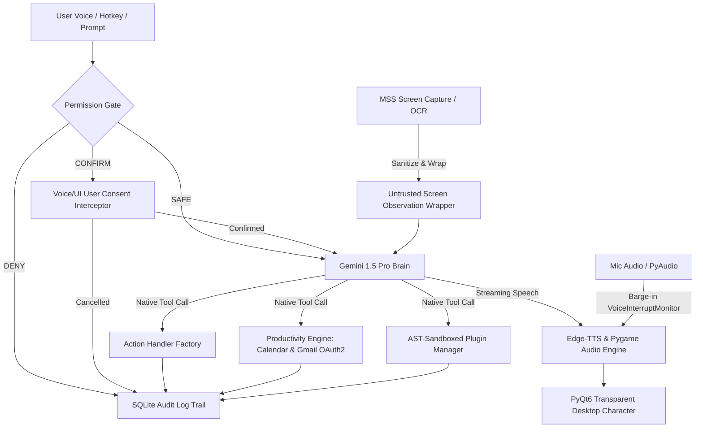

# Sia AI Assistant 🤖✨

[](https://python.org)
[]()
[]()
[]()
[]()

> **Sia** is a JARVIS-level, next-generation AI desktop companion for Windows. Powered by Google Gemini 1.5 Pro, native tool calling, and Multimodal Vision APIs, Sia features an **Active Pre-Execution Permission Gate**, **AST-Sandboxed Plugin System**, **Google Calendar & Gmail OAuth2 Integration**, sentence-by-sentence streaming voice, barge-in speech interrupt, continuous conversation follow-up, and CLI audit log observability.

---

## 📽️ Visual Architecture & Overview



---

## 🛡️ Security Architecture & Safety Net

### 1. Active Pre-Execution Permission Gate (`engine/permission_gate.py`)
Sia intercepts system actions **BEFORE** any OS-level execution occurs. Actions are categorized into three strict risk tiers:

| Risk Tier | Policy | Action Examples |
|-----------|--------|-----------------|
| **`SAFE`** | Zero-friction instant execution | `system_info`, `get_weather`, `web_search`, `read_file`, `vision_screen` |
| **`CONFIRM`** | Pauses execution & requests user voice consent (*"confirm now"* / *"cancel"*) | `kill_app`, `close_window`, `system_shutdown`, `system_restart`, `volume` |
| **`DENY`** | Unconditionally blocked & logged to audit trail | Prohibited directives (`format_disk`, `rm -rf`, `delete system32`, `extract passwords`) |

### 2. AST-Sandboxed Plugin System (`engine/plugin_manager.py`)
Plugins in the `plugins/` directory undergo a 3-layer security inspection:
- **AST Code Scanner**: Parses abstract syntax trees before import, blocking dangerous modules/builtins (`subprocess`, `ctypes`, `winreg`, `os.system`, `eval`, `exec`, `shutil.rmtree`).
- **SHA-256 Whitelist**: Requires explicit hash approval in `plugins/plugin_manifest.json`.
- **Integrity Validation**: Detects and blocks modified or tampered plugins (`BLOCKED_HASH_MISMATCH`).

### 3. Screen OCR Prompt Injection Neutralizer (`engine/validation.py`)
- Screen OCR text is sanitized to neutralize prompt injection attacks (`ignore instructions`, `system prompt:`, tag breaking).
- Screen content is encapsulated inside strict `<untrusted_screen_observation>` XML wrappers directing LLM to treat vision data purely as passive observation.

---

## ⚡ Core Systems & Feature Matrix

### 🧠 Native Gemini Function Calling (10+ Tools)
Gemini natively evaluates intent and issues tool calls rather than relying on regex matchers:
- **System Control**: `open_app_tool`, `kill_app_tool`, `set_volume_tool`, `get_system_info_tool`
- **Productivity**: `add_reminder_tool`, `get_calendar_events_tool`, `get_unread_emails_tool`
- **Search & Vision**: `web_search_tool`, `get_news_tool`, `analyze_screen_tool`

### 📅 Live Google Calendar & Gmail OAuth2 Integration
- **Google Calendar API**: Queries primary calendar for today's agenda and includes live schedule in the morning daily briefing.
- **Gmail API**: Fetches real unread primary email digests (Sender & Subject snippets).
- **Token Caching & Fallback**: Caches OAuth tokens in `token.json` and falls back cleanly to local SQLite reminders if credentials are missing.

### 🎙️ Continuous Voice Session & Barge-in Speech Interrupt
- **VoiceInterruptMonitor**: Listens to microphone RMS volume while Sia speaks. User speaking immediately stops TTS playback (*barge-in*).
- **Continuous Session Window**: Keeps a 5-second follow-up window active after Sia responds, allowing users to ask follow-up questions without repeating *"Hey Sia"*.

### 📊 Observability & Audit Log Trail Viewer
- Every action, risk assessment, and permission decision is recorded to `memory.db` (`audit_logs` table).
- Interactive CLI audit viewer (`scripts/view_audit_logs.py`) for inspecting system activity:
  ```bash
  # View recent audit logs
  python scripts/view_audit_logs.py --limit 20

  # Filter blocked/denied actions
  python scripts/view_audit_logs.py --risk DENY

  # Export logs to JSON or CSV
  python scripts/view_audit_logs.py --json
  python scripts/view_audit_logs.py --csv audit_report.csv
  ```

---

## 🛠️ Installation & Setup

### 1. Clone & Install Dependencies
```bash
git clone https://github.com/amar-kumar-cse/Sia_Assistant.git
cd Sia_Assistant
pip install -r requirements.txt
```

### 2. Environment & Google OAuth Setup
1. Create `.env` file from example:
   ```bash
   cp .env.example .env
   ```
2. Add your Gemini API key:
   ```env
   GEMINI_API_KEY=your_gemini_key_here
   ```
3. *(Optional)* For Google Calendar & Gmail OAuth sync:
   - Download `credentials.json` (OAuth 2.0 Desktop Application) from [Google Cloud Console](https://console.cloud.google.com/).
   - Place `credentials.json` in the root directory.

### 3. Launch Sia
```bash
python main.py
```

---

## 🧪 Testing & Security Verification

Run the full test suite including the Adversarial Security Verification test suite:
```bash
# Run standard unit tests
pytest tests/ -v --ignore=tests/test_deep_coverage.py

# Run Adversarial Security Verification Suite
pytest tests/test_adversarial_security.py -v
```

---

## 👨‍💻 Author

**Amar Kumar**
- 🔗 GitHub: [@amar-kumar-cse](https://github.com/amar-kumar-cse)

---

## 📄 License
Distributed under the MIT License. Built with ❤️ by Amar Kumar.
