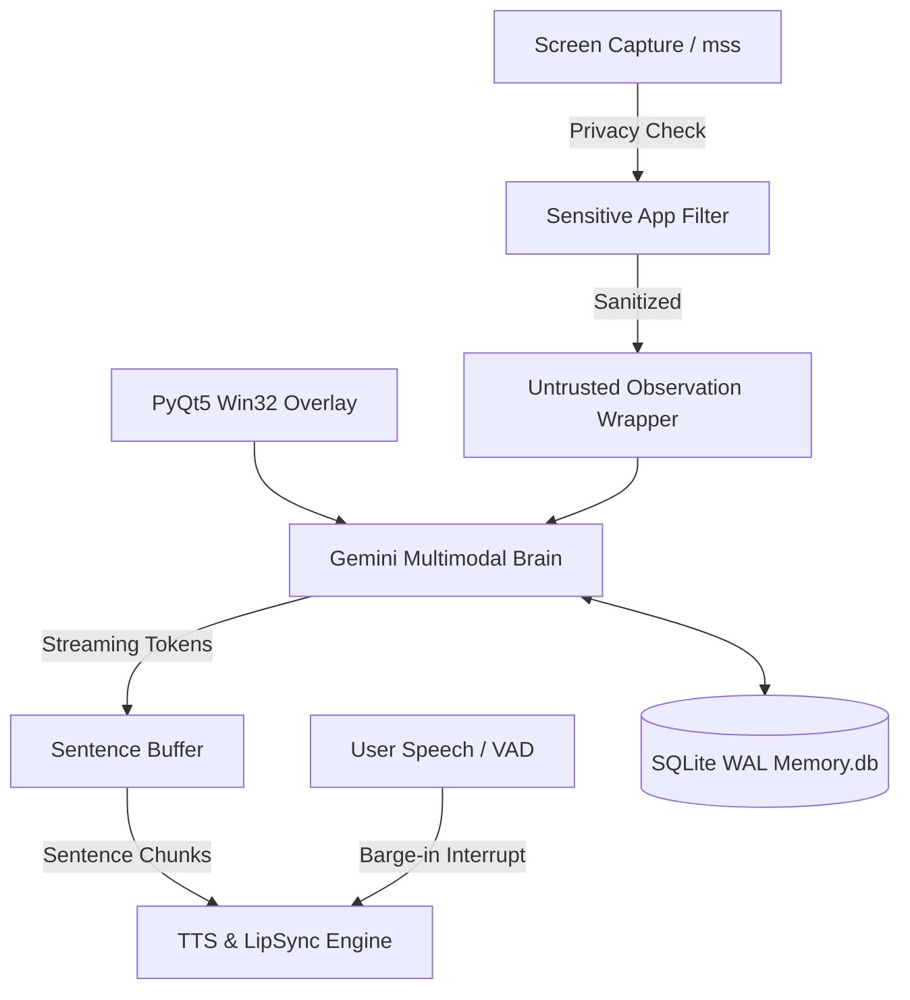

# Sia AI Assistant 🤖✨

[](https://python.org)
[]()
[]()
[]()

> **Sia** is a next-generation AI desktop assistant that lives on your Windows screen as an interactive transparent character. Powered by Google Gemini 1.5 Pro and Multimodal Vision APIs, Sia features real-time screen awareness, structured semantic memory, sentence-by-sentence streaming voice playback, and instant barge-in speech interruption.

---

## 📽️ Demo & Visual Preview


*(15-second preview: Click-through transparent avatar, real-time screen analysis, streaming TTS response, and barge-in speech interrupt)*

---

## 🏗️ System Architecture

```
                                  ┌──────────────────────────┐
                                  │      User Input / Voice  │
                                  └────────────┬─────────────┘
                                               │
                                               ▼
┌──────────────────────────┐      ┌──────────────────────────┐      ┌──────────────────────────┐
│   Screen / Vision (mss) │ ────► │ Injection Neutralizer    │ ────► │ Gemini Multimodal Brain  │
│ [Privacy Exclusion Active]│      │ <untrusted_observation>  │      │   [Multi-Key Rotation]   │
└──────────────────────────┘      └──────────────────────────┘      └────────────┬─────────────┘
                                                                                 │ Streaming
                                                                                 ▼
┌──────────────────────────┐      ┌──────────────────────────┐      ┌──────────────────────────┐
│  Pygame / LipSync Engine │ ◄─── │ Sentence-by-Sentence TTS │ ◄─── │ Structured Memory (DB)   │
│   [Barge-in Interrupt]   │      │ (Edge-TTS / ElevenLabs)  │      │ [Fact Extraction/Forget] │
└──────────────────────────┘      └──────────────────────────┘      └────────────┬─────────────┘
```



---

## 🚀 Key Features & Production Architecture

### 🛡️ 1. Prompt Injection Protection (Screen Awareness Security)
- Screen OCR and visual analysis data are stripped of malicious injection patterns (`ignore instructions`, `system prompt:`, tag breaks) using `engine/validation.py`.
- Vision observations are encapsulated inside strict `<untrusted_screen_observation>` blocks, explicitly directing LLM to treat them purely as passive visual observation data.

### 🔒 2. Privacy & Consent Layer
- **Automated Sensitive App Exclusion**: Screen vision captures are automatically suppressed if active window titles match privacy patterns (`bank`, `password`, `keepass`, `bitwarden`, `1password`, `wallet`, `credentials`, `auth`, `card`).
- **One-Click Vision Pause**: Toggle screen watching on/off directly from UI or tray settings.
- **Immediate File Cleanup Policy**: Temp screenshot files are deleted immediately after analysis in `finally:` blocks.

### 🧠 3. Structured Semantic Memory & Forget Engine
- **`user_facts` Schema**: Persistent SQLite database storing extracted facts, preferences, and entity knowledge (`memory.db` with WAL mode).
- **Forget Mechanism**: Say *"mat yaad rakhna"* or *"forget this"* to purge specific facts from Sia's active memory.
- **Rolling Context Summarization**: Automatically budgets and compresses conversation history to ensure prompt context limits are never exceeded.

### ⚡ 4. Low-Latency Streaming & Barge-in Speech Interrupt
- **Sentence-by-Sentence TTS**: Gemini streams responses directly into a sentence splitter buffer, starting voice playback on the very first completed sentence for near-zero response latency.
- **Barge-in Interrupt**: Instantly cancels active audio playback and clears speech queues when the user speaks or triggers hotkeys.

### 📦 5. Packaging & First-Run Setup Wizard
- **GUI Setup Wizard (`setup_wizard.py`)**: Automatically launches if `.env` or `GEMINI_API_KEY` is missing, allowing users to enter keys via a clean GUI.
- **Standalone Executable Builder (`build_exe.py` / `sia.spec`)**: One-command PyInstaller build configuration for distributing standalone Windows `.exe`.

### 📊 6. Observability & Crash Reporting
- **Structured JSON Logging**: Standard JSON log records for easy log parsing and diagnostics (`logs/sia_error.log`).
- **Unhandled Crash Reporter**: Global exception hooks (`sys.excepthook`, `threading.excepthook`) log detailed crash tracebacks to `logs/crash.log`.

---

## 🛠️ Quick Start & Installation

### Option A: Running from Source
```bash
# 1. Clone repository
git clone https://github.com/AmarKumar-hub-ai/Sia_Assistant.git
cd Sia_Assistant

# 2. Install dependencies
pip install -r requirements.txt

# 3. Launch Sia (First-Run Wizard will prompt for API keys if .env is missing)
python main.py
```

### Option B: Building Standalone Windows Executable
```bash
python build_exe.py
```
Output executable will be placed in `dist/SiaAssistant.exe`.

---

## 🧪 Testing & Code Quality

Run the test suite with coverage:
```bash
pytest --cov=engine tests/
```

---

## 👨‍💻 Author

**Amar Kumar**
- 🔗 GitHub: [@AmarKumar-hub-ai](https://github.com/AmarKumar-hub-ai)
- 💼 LinkedIn: [linkedin.com/in/amarkumarr](https://linkedin.com/in/amarkumarr)

---

## 📄 License
Distributed under the MIT License. Built with ❤️ by Amar Kumar.
